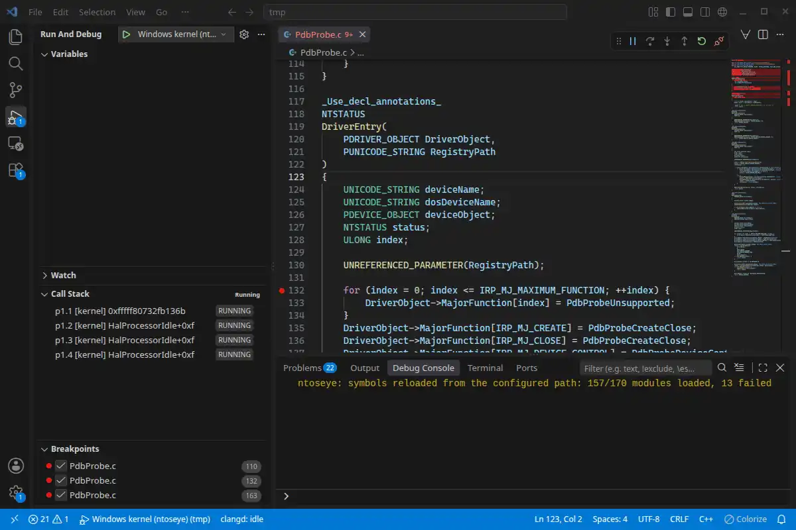

# ntoseye


[](LICENSE)
[](https://github.com/dmaivel/ntoseye/releases/latest)
[](https://crates.io/crates/ntoseye)
[](https://docs.rs/ntoseye)

A WinDbg-like Windows debugger for Linux and macOS, with support for kernel-mode and user-mode debugging of virtual and physical machines, and offline crash-dump analysis.

## Showcase

| Debugging via REPL | Debugging via VSCode + DAP |
| - | - |
|  |  |

## Features

- WinDbg-style commands and expressions
- Public and private PDB symbols, source lines, and local variables
- Conditional and deferred breakpoints, hardware watchpoints, and breakpoint commands
- [KD/KDNET, QEMU GDB, and passive memory backends](docs/backends.md)
- [Host-served driver images for driver development](docs/kdfiles.md)
- [Python SDK and custom commands](docs/sdk.md)
- [Editor integration over DAP](docs/dap.md)
- [IDA, Binja, Ghidra over the GDB remote protocol](docs/gdbserver.md)
- [Agent integration over MCP](docs/mcp.md)

### Supported Windows

`ntoseye` supports 64-bit AMD64 and ARM64 Windows 10 and 11 targets.

### Supported hypervisors

`ntoseye` supports any hypervisor, cloud VM, or physical machine reachable over [KDNET](docs/kdnet.md). KVM/QEMU, VMware Workstation, and UTM guests additionally get [KDCOM, GDB, and memory-only backends](docs/backends.md).

### Files and network access

`ntoseye` downloads symbols and images from Microsoft's official symbol server when required. Config, cache, and REPL state live under `~/.ntoseye`:

- `~/.ntoseye/commands/` for custom scripted commands
- `~/.ntoseye/symbols/` for PDBs and images, a symbol store in the `symstore` layout that WinDbg, IDA, Ghidra, and rizin read
- `~/.ntoseye/aliases` for command aliases
- `~/.ntoseye/history` for persistent REPL history

# Getting started

## Install via shell script

```bash
curl --proto '=https' --tlsv1.2 -LsSf https://github.com/dmaivel/ntoseye/releases/latest/download/ntoseye-installer.sh | sh
```

Prebuilt release binaries include the CLI and MCP server but omit embedded Python for portability. Use a Cargo or source build for [in-REPL Python commands](docs/sdk.md); the standalone `pip install ntoseye` SDK needs neither.

## Install via cargo

```bash
cargo install ntoseye
```

`cargo install` and default source builds enable embedded Python and link against the local Python installation.

## Install the Python SDK

For standalone debugger automation from Python on Linux or Apple Silicon macOS:

```bash
pip install ntoseye
```

The Python package exposes the debugger through `import ntoseye`; it does not install the `ntoseye` CLI. See the [Python SDK documentation](docs/sdk.md).

## Building

```bash
git clone https://github.com/dmaivel/ntoseye.git
cd ntoseye
cargo build --release
```

To build without embedded Python:

```bash
cargo build --release --no-default-features --features cli,mcp,dap,gdbserver
```

# Usage

## Quickstart

If you are using QEMU/KVM, VMware, or UTM, you can use `ntoseye configure` for easy setup. Otherwise, look at [KDNET](docs/kdnet.md) instructions.

1. Power off the Windows VM.
2. Run `ntoseye configure` and select the hypervisor, virtual machine, and debugger backend. Note the `Run` command it prints.
3. Start the VM, run the printed guest setup commands in Administrator PowerShell, and reboot.
4. On Linux, allow `ntoseye` to inspect the hypervisor process. This resets on reboot:
   ```bash
   echo 0 | sudo tee /proc/sys/kernel/yama/ptrace_scope
   ```
   Alternatively, prefix the printed `Run` command with `sudo`.
5. Run the command saved in step 2.

Run `ntoseye status` at any time to inspect configured transports, assigned guest ports, endpoints, and launch commands without changing a VM.

### Hypervisor setup

`ntoseye configure` handles automatic setup for supported libvirt, VMware Workstation, and UTM guests. For plain QEMU or manual configuration, see the [KVM/QEMU](docs/kvm-qemu.md), [VMware](docs/vmware.md), and [UTM](docs/utm.md) setup guides.

For any other hypervisor, a cloud VM, or a physical machine, follow the [KDNET guide](docs/kdnet.md) instead; `configure` is not needed.

### Not sure which backend to use?

See the [backend comparison table](docs/backends.md).

# Documentation

The debugger is self-documented: run `ntoseye --help` for command-line arguments, and press tab in the REPL for completions and descriptions of commands, symbols, and types.

- [REPL usage](docs/usage.md): expressions, radix, breakpoints, watchpoints, aliases
- [Symbols and source](docs/symbols.md): private PDBs, `.sympath`/`.srcpath`, source breakpoints
- [Choosing a backend](docs/backends.md): kd/kdnet/gdb/memory comparison, per-hypervisor setup for [KVM/QEMU](docs/kvm-qemu.md), [VMware](docs/vmware.md), and [UTM](docs/utm.md)
- [KDNET](docs/kdnet.md): `kdnet.exe` guest setup, host launch, reboot behavior
- [Crash dumps](docs/dumps.md): offline dump analysis, generating dumps, guest tweaks
- [Driver replacement map](docs/kdfiles.md): `.kdfiles`, loading a driver from the host instead of the guest
- [Python SDK and custom commands](docs/sdk.md)
- [MCP integration](docs/mcp.md)
- [Editor integration (DAP)](docs/dap.md): source-level debugging from VS Code, Emacs (dape), or nvim-dap
- [Disassembler integration (GDB remote protocol)](docs/gdbserver.md): debugging from IDA, Binary Ninja, Ghidra, gdb, or lldb

# Credits

Functionality regarding initialization of guest information was written with the help of the following sources:

- [vmread](https://github.com/h33p/vmread)
- [pcileech](https://github.com/ufrisk/pcileech)
- [MemProcFS](https://github.com/ufrisk/MemProcFS)
- [ReactOS](https://github.com/reactos/reactos)
