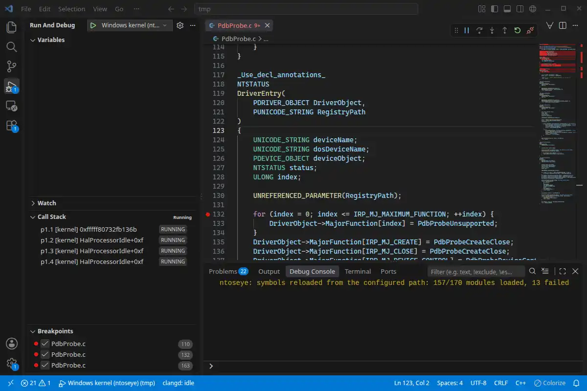

# ntoseye

`ntoseye` is a Windows debugger for Linux and macOS. It debugs the Windows kernel and user-mode processes on virtual and physical machines, and analyzes crash dumps offline, using WinDbg's command language.

| Debugging via REPL | Debugging via VS Code + DAP |
| - | - |
|  |  |

`ntoseye` is available under the MIT license.

## Using ntoseye

If you are new to `ntoseye`, [install](get-started/install.md) it, attach to a VM with the [Quickstart](get-started/quickstart.md), and then work through [Your first session](get-started/tutorial.md), which goes from attaching to stepping through code. If you already know WinDbg, [Coming from WinDbg](get-started/windbg.md) lists what carries over and what is different.

The [command reference](reference/commands/index.md) documents every REPL command, and `.hh <command>` shows the same text in the REPL. To control the debugger from code, start with the [Python SDK](scripting/sdk.md).

## Debugging from the host

`ntoseye` runs outside the machine it debugs and connects to it through one of four backends:

| Backend | Connects over | Needs in Windows | Stops and steps |
| --- | --- | --- | --- |
| `kd` | KDCOM, on a VM serial port | Kernel debugging | Yes |
| `kdnet` | KDNET, on the network | Kernel network debugging | Yes |
| `gdb` | The hypervisor's GDB stub | Nothing | Yes |
| `memory` | The VM's memory | Nothing | No |

KDNET can connect to any physical or virtual machine that Windows can debug. With `gdb` and `memory`, Windows runs with its debugger disabled and does not know that it is being debugged. When the VM runs on the same host, `ntoseye` reads guest memory directly from the VM process where it can, instead of through the debugger transport. [Choosing a backend](setup/backends.md) compares the backends in full.

Because `ntoseye` reads memory itself, it can show things that the Windows debugger cannot:

- The [secure kernel and trustlets](vbs/secure-kernel.md) that virtualization-based security isolates in VTL1.
- [Where each processor was](vbs/hypervisor-stops.md) when it stopped inside the Windows hypervisor.
- The [guests that the Windows hypervisor runs](vbs/guest-partitions.md), such as a Windows Sandbox, with their own kernel's symbols.

## Symbols and source

`ntoseye` downloads symbols from Microsoft's symbol server into a cache with the `symstore` layout, which WinDbg, IDA, and Ghidra also read.

For your own drivers, [private PDBs and local source](using/symbols.md) add source lines, local variables, and source breakpoints, and [driver replacement](using/kdfiles.md) loads a rebuilt driver from the host without copying it into the guest.

## Platform support

`ntoseye` debugs 64-bit Windows 10 and 11 on AMD64 and ARM64, live or from a crash dump. It runs on Linux (x86-64 and ARM64) and on macOS on Apple Silicon.

It sets up and works directly with [KVM/QEMU](setup/kvm-qemu.md) and [VMware Workstation](setup/vmware.md) on Linux and [UTM](setup/utm.md) on macOS. Any other machine, physical or virtual, connects over [KDNET](setup/kdnet.md).

## Get involved

The source code is on [GitHub](https://github.com/dmaivel/ntoseye) and builds with Cargo:

```bash
git clone https://github.com/dmaivel/ntoseye.git
cd ntoseye
cargo build --release
```

Report bugs on the [issue tracker](https://github.com/dmaivel/ntoseye/issues), and ask questions or show what you have built in [Discussions](https://github.com/dmaivel/ntoseye/discussions).

```{toctree}
:hidden:
:caption: Getting started

get-started/install
get-started/quickstart
get-started/tutorial
get-started/windbg
get-started/troubleshooting
reference/command-line/index
```

```{toctree}
:hidden:
:caption: Setting up a target

setup/backends
setup/kvm-qemu
setup/vmware
setup/utm
setup/kdnet
```

```{toctree}
:hidden:
:caption: Using ntoseye

using/repl
using/breakpoints
using/memory
using/symbols
using/bugchecks
using/dumps
using/kdfiles
using/kmdf
using/virtio
using/storport
using/ndis
using/drivers
```

```{toctree}
:hidden:
:caption: Platform topics

platforms/wow64
```

```{toctree}
:hidden:
:caption: VBS and the Windows hypervisor

Overview <vbs/index>
vbs/sandbox-tutorial
vbs/secure-kernel
vbs/partitions
vbs/guest-partitions
vbs/hypercalls
vbs/hypervisor-stops
vbs/internals
```

```{toctree}
:hidden:
:caption: Integrations

integrations/dap
integrations/gdbserver
integrations/mcp
```

```{toctree}
:hidden:
:caption: Scripting

scripting/sdk
scripting/commands
reference/sdk/index
```

```{toctree}
:hidden:
:caption: Reference

reference/commands/index
reference/expressions
```

```{toctree}
:hidden:
:caption: Internals

internals/kd-reads
Rust crate API (docs.rs) <https://docs.rs/ntoseye/latest/ntoseye/>
```

```{toctree}
:hidden:
:caption: Resources

changelog
Source code <https://github.com/dmaivel/ntoseye>
Releases <https://github.com/dmaivel/ntoseye/releases>
Bug reports <https://github.com/dmaivel/ntoseye/issues>
Discussions <https://github.com/dmaivel/ntoseye/discussions>
PyPI package <https://pypi.org/project/ntoseye/>
crates.io <https://crates.io/crates/ntoseye>
```
